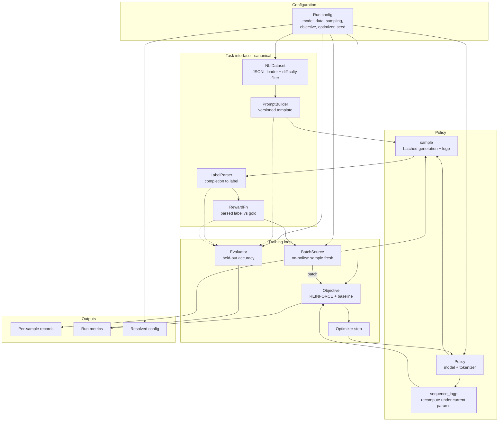

## On-policy REINFORCE baseline

### 1. Executive summary

#### 1.1 Spec description

An on-policy REINFORCE training harness for the contextual-bandit NLI task, together with the canonical definition of that task's interface layer. The harness loads the synthetic NLI dataset produced per data spec 02, renders each example into a prompt, samples a completion from a small decoder-only LLM, parses a label from the completion, computes a deterministic reward, and updates the policy by policy gradient.

Because it is the first implementation in the project, this spec also fixes the bandit formalization that later specs depend on:

- **context / action / reward** — context is a `(premise, hypothesis)` pair from the dataset; the action is the full generated completion (not the parsed label), so that sequence-level importance ratios are well-defined for tasks 04–05; the reward is deterministic in the parsed label and `gold_label`
- **prompt construction** — a deterministic, versioned template mapping a dataset example to a prompt string
- **parsing** — a deterministic function from completion text to a canonical label or parse-failure, over the label set fixed by data spec 02
- **per-sample record schema** — the fields logged for every interaction, including behaviour-policy bookkeeping

Delivered scope is the on-policy path only: one policy, no replay buffer, no policy lag, no off-policy corrections. Components are built with explicit extension seams — a pluggable loss objective, a batch-source abstraction, and behaviour-policy bookkeeping written from day one — so tasks 03 (replay buffer), 04 (off-policy objectives) and 05 (staleness) extend this harness rather than replace it.

#### 1.2 Spec motivation

Every later M1 task builds on this harness, and every off-policy result is measured against the baseline it produces. Four things must be established before any off-policiness knob is meaningful:

1. **The task interface exists and is canonical.** Prompt, parser, reward, and record schema are currently undefined in any current document. Off-policy corrections are defined over the action's log-probability, so the action must be pinned down before they can be implemented.
2. **The pipeline is correct.** Reward parsing, sequence log-probability computation, and gradient flow must be verified in the simplest possible setting. Debugging them jointly with a replay buffer and importance weights is far harder — an incorrect `logp` and a genuine off-policy instability present similarly.
3. **The task is learnable.** If the model cannot exceed the 33% chance floor under ideal on-policy conditions, there is no signal for off-policiness to degrade and the testbed is invalid.
4. **The baseline exists.** RQ1's "effect on stability, sample efficiency, and final accuracy" is defined as a difference from on-policy training; without this reference curve no off-policy measurement is interpretable.

This corresponds to task 02 in `tasks-M1.md` and is a prerequisite for the constitution's §8 calibration gate (a).

#### 1.3 Implementation repos

- `off-policy-for-toy-llms` — harness in `code/src/`, configs and entry-point scripts in `code/`; consumes synthetic NLI JSONL from `data/` (DVC-tracked, produced per data spec 02 via `slam-datagen`)

### 2. Requirement analysis

#### 2.1 Functional requirements

**Task interface (canonical definitions)**

- **FR1 — Prompt construction.** A deterministic function mapping a dataset example to a prompt string, using a versioned template. The template identifier must be recorded per run. The prompt must present `premise` and `hypothesis` and request one of the three canonical labels.
- **FR2 — Label parsing.** A deterministic function `parse(completion_text) -> (label | None, parse_success)` over the canonical label set fixed by data spec 02 (`entailment`, `neutral`, `contradiction`). Parsing must be case-insensitive, must tolerate leading whitespace/punctuation, and must accept completions containing text beyond the label. It must never raise on arbitrary model output.
- **FR3 — Reward.** A deterministic function of the parsed label and `gold_label`: reward 1 for a correct parsed label, 0 otherwise; a parse failure yields reward 0. Reward must depend on nothing else (no length or format bonuses) so that the reward channel remains noise-free per constitution §2.3.
- **FR4 — Action definition.** The action is the full generated completion token sequence. All log-probabilities are sequence-level sums over generated tokens only, excluding prompt tokens.

**Data and generation**

- **FR5 — Dataset loading.** Load JSONL splits conforming to the data spec 02 schema, exposing `train` and `eval` splits. Must validate required fields on load and fail loudly on schema violations. Must support filtering by `hop_difficulty`, `distractor_difficulty`, and `background_knowledge` so the difficulty mix of a run is explicit and controllable.
- **FR6 — Batched sampling.** Sample completions for a batch of prompts from the current policy with configurable decoding parameters (temperature, top-p, max new tokens). The decoding parameters actually used must be recorded per sample.
- **FR7 — Behaviour log-probability.** For each sampled completion, compute and store the sequence log-probability under the policy that generated it, at generation time.

**Training**

- **FR8 — Policy gradient update.** Implement the REINFORCE objective with a configurable baseline for variance reduction (at minimum: no baseline, and batch-mean reward). The loss must be exposed through a pluggable objective interface so tasks 04–05 can add IS-clipped and KL-regularized variants without modifying the training loop.
- **FR9 — Target log-probability recomputation.** Recompute the sequence log-probability of a stored completion under the current policy — the quantity gradients flow through, and the numerator of the importance ratio in task 04. On-policy this is computed on freshly sampled data; the interface must not assume the sampling policy and the updating policy are identical.
- **FR10 — Batch source abstraction.** The training loop must obtain batches through an abstraction whose on-policy implementation samples fresh data each step, so task 03 can substitute a replay-buffer-backed source without touching the loop.
- **FR11 — Evaluation.** Periodic evaluation on the held-out split, reporting accuracy and mean reward. Evaluation decoding settings must be configurable independently of training (in particular, greedy decoding must be available).

**Logging and reproducibility**

- **FR12 — Per-sample records.** Every interaction is recorded with: example id, prompt text, gold label, completion text and token ids, parsed label, parse success, reward, behaviour log-probability, behaviour policy identifier, learner step, and the decoding parameters used. The schema must accommodate the fields tasks 03–05 require (staleness, importance weights) without a breaking change.
- **FR13 — Run metrics.** Log per training step: mean reward, running accuracy, parse success rate, loss, gradient norm, policy entropy, and mean/std of the sequence log-probability. Log per evaluation: held-out accuracy and mean reward. Metrics must be persisted in a machine-readable form for later plotting.
- **FR14 — Configuration.** All experiment parameters supplied through configuration files rather than code edits or hardcoded defaults, with the fully resolved config saved alongside the run's outputs.
- **FR15 — Seeding.** A single run seed controls model init, data ordering, and sampling; re-running with the same seed and config reproduces the same metrics.

#### 2.2 Non-functional requirements

- **NFR1 — Single-GPU budget.** Must run end-to-end on one consumer GPU (RTX 3090/4090 class, 24 GB) per constitution §7, including a base model, sampling, and gradient computation. Batch size and sequence length defaults must fit this budget.
- **NFR2 — Baseline run turnaround.** A full baseline run should complete within a few hours, so that later sweeps over off-policiness knobs (dozens to hundreds of runs) remain feasible within the milestone.
- **NFR3 — Extensibility.** Adding an off-policy objective (task 04) or a replay-backed batch source (task 03) must require implementing the corresponding interface only, with no changes to the training loop, task interface, or record schema.
- **NFR4 — Determinism.** Given a fixed seed and config, runs are reproducible up to documented GPU non-determinism; any deliberately non-deterministic component must be identified.
- **NFR5 — Model-agnosticism.** The base model is a configuration value. Nothing in the harness may assume a specific checkpoint or tokenizer, so a second model size can be swapped in without code changes.
- **NFR6 — Testability.** Task interface functions (prompt, parse, reward) and log-probability computation must be unit-testable without a GPU; a tiny model must be usable in tests for the full loop.

### 3. Acceptance criteria

Verification is layered: unit tests for the task interface, numerical tests for log-probability and gradients, an integration test for the loop, and finally an end-to-end run establishing the baseline. Layers 1–3 run in CI without a GPU; layer 4 is a manually inspected run.

#### 3.1 Task interface tests (FR1–FR4)

- **AC1 — Prompt determinism.** The same example yields a byte-identical prompt across calls and processes. Prompts for distinct examples differ. The template identifier is retrievable and appears in the run config.
- **AC2 — Parser correctness.** Table-driven tests over completions covering: each canonical label alone; correct label with trailing text; leading whitespace and punctuation; mixed case; a label appearing as a substring of another word (must not match); an empty completion; a completion with no label; a completion containing two different labels (documented, deterministic resolution). Each case asserts both `parsed_label` and `parse_success`.
- **AC3 — Parser total.** Property-style test over random and adversarial strings (including unicode and very long strings) asserting the parser returns without raising and always yields a valid `(label | None, parse_success)` pair.
- **AC4 — Reward correctness.** Reward is 1 exactly when `parse_success` is true and the parsed label equals `gold_label`; 0 in all other cases, including every parse failure. A test asserts reward is invariant to completion length and to text following the label.
- **AC5 — Action scope.** A test asserts sequence log-probability is computed over generated tokens only: prepending different prompts of different token lengths to the same completion changes the value, while padding tokens do not contribute.

#### 3.2 Log-probability and gradient tests (FR7, FR9)

- **AC6 — Log-probability agreement.** For a tiny model, the sequence log-probability computed during generation (FR7) matches the value recomputed by the training path (FR9) on the same completion under the same unchanged policy, to within floating-point tolerance. This is the single most important correctness check in the spec: it validates that behaviour and target log-probabilities are computed consistently, which every off-policy result in tasks 04–05 depends on.
- **AC7 — Manual reference.** For a fixed tiny model and a short completion, the computed sequence log-probability matches an independently written reference implementation (naive per-token loop over logits) to within tolerance — guarding against masking and off-by-one errors in the batched implementation.
- **AC8 — Masking correctness.** With a batch of completions of differing lengths, each sequence's log-probability equals the value obtained by computing it alone, unbatched. This catches padding leaking into the sum.
- **AC9 — Gradient flow.** A single REINFORCE step on a tiny model produces finite, non-zero gradients on the policy parameters; gradient norm is finite; no parameter receives `NaN`. A test asserts gradients are zero when all rewards in the batch are equal under the batch-mean baseline (the degenerate case), and non-zero otherwise.
- **AC10 — Gradient direction.** On a hand-constructed batch containing one rewarded and one unrewarded completion, a single update increases the sequence log-probability of the rewarded completion and decreases that of the unrewarded one. This asserts the sign convention of the objective is correct — a silent sign error would otherwise surface only as a failure to learn.

#### 3.3 Integration tests (FR5, FR6, FR8, FR10–FR15)

- **AC11 — Loop runs end-to-end.** A short run with a tiny model on a small dataset slice completes without error, producing metrics and per-sample records.
- **AC12 — Record schema.** Every per-sample record emitted by the run contains all FR12 fields with correct types; a schema validation test asserts no field is missing or null where required.
- **AC13 — Metrics present.** All FR13 metrics are present in the persisted output at the expected cadence, are machine-readable, and contain no `NaN`.
- **AC14 — Reproducibility.** Two runs with identical config and seed produce identical metric series and identical per-sample records. A third run with a different seed differs.
- **AC15 — Config completeness.** The resolved config is saved with the run outputs, and a run can be reproduced from the saved config alone with no additional arguments.
- **AC16 — Overfitting sanity check.** On a deliberately tiny slice (a handful of examples, repeated), training drives mean reward to near 1.0. This proves the objective can move the policy at all, independently of whether the real task is learnable — separating "the optimizer works" from "the task is hard".
- **AC17 — Extension seams.** Test-only implementations of the objective interface and the batch-source interface can be substituted and drive the loop unchanged, demonstrating NFR3 without waiting for tasks 03–04.

#### 3.4 Baseline run criteria (end-to-end)

- **AC18 — Learning above chance.** A full baseline run on the synthetic NLI dataset reaches held-out accuracy significantly above the 33% chance floor, across at least 3 seeds, with the separation from chance visible as non-overlapping confidence intervals. This is the criterion that task 02 exists to establish.
- **AC19 — Parse health.** Parse success rate reaches and remains high (target: above 95%) by the end of training. A persistently low rate means the model is failing at output format rather than at the reasoning task, which would confound every downstream reward measurement.
- **AC20 — Numerical health.** No `NaN`/`Inf` events; gradient norms remain bounded; policy entropy does not collapse to zero. These are the necessary-but-not-sufficient stability signals per constitution §8.
- **AC21 — Budget compliance.** The run completes on a single consumer GPU within the NFR2 turnaround, with peak memory recorded and within the NFR1 budget.

**Explicitly out of scope.** Establishing the *non-saturating accuracy band* — the difficulty mix at which the baseline is neither at chance nor near ceiling — is not an acceptance criterion here. AC18 asserts only that learning happens. The band is a calibration finding requiring a sweep over the dataset's `hop_difficulty` and `distractor_difficulty` axes, and it is what discharges constitution §8 gate (a); it currently has no task in `tasks-M1.md`.

### 4. Insight

#### 4.1 Build on an existing RL library vs. implement the loop directly

**Option A — adopt an existing RLHF/RL library** (e.g. TRL, or a similar policy-optimization framework). Provides tested generation, log-probability, and PPO-family objectives out of the box; less code to write.

**Option B — implement the training loop directly** on top of a bare transformer library, writing generation, log-probability computation, and the REINFORCE objective ourselves.

**Choice: B.** The research object *is* the training dynamics under off-policiness. Existing libraries wrap exactly the machinery we need to instrument and modify — importance-ratio computation, the staleness of the policy used for sampling, and the loss — behind abstractions designed to hide them. Tasks 04–05 need to change these internals, and the constitution's validation philosophy requires per-sample staleness and diagnostic logging that no off-the-shelf trainer emits. Adopting a library would mean fighting its control flow within weeks. The counter-argument — more code, more bug surface — is real and is why §3.2's acceptance criteria are unusually heavy on numerical verification. A secondary benefit is that a bandit (single-step, no value function, no GAE, no critic) requires a small fraction of a full PPO implementation, so the code we forgo is largely code we would not use.

#### 4.2 Reward channel: binary correctness vs. shaped reward

**Option A — binary reward**, 1 for a correct parsed label, 0 otherwise (including parse failures).

**Option B — shaped reward** adding a partial credit term for well-formed output, to help the model first learn the response format and only then the task.

**Choice: A.** Constitution §2.3 requires rewards to be deterministic and programmatically computable, and the project's motivation is explicitly that this testbed avoids the reward-design confounders present in RLHF. A format bonus makes measured accuracy a function of a reward-shaping hyperparameter, which would then interact with every off-policiness knob and contaminate RQ1's attribution. If format learning proves to be a genuine bottleneck — visible as a persistently low parse success rate under AC19 — the correct remedy is prompt engineering or a short supervised warm start, both of which leave the reward channel clean. This is recorded as the fallback rather than shaping.

#### 4.3 Off-policy readiness: seams now vs. retrofit later

**Option A — minimal on-policy baseline**, with the objective and data path written directly into the loop; refactor when tasks 03–05 arrive.

**Option B — build the seams now**: a pluggable objective interface, a batch-source abstraction, and full behaviour-policy bookkeeping (`logp_behavior`, `behavior_policy_id`) recorded from day one, even though on-policy the importance ratio is identically 1.

**Choice: B.** The cost is low — three interfaces and a handful of always-populated record fields — and it buys a property that is otherwise hard to obtain: with behaviour log-probabilities recorded on-policy, task 04 gains a free correctness check, since an IS-weighted objective evaluated on fresh data must reproduce plain REINFORCE exactly (all weights equal 1). That test is impossible if the bookkeeping is retrofitted. The risk of speculative generality is bounded because the interfaces are dictated by three concrete, already-planned consumers, not hypothetical ones. The counter-argument favouring A — that premature abstraction based on a guess at future needs usually ages badly — is acknowledged; it is mitigated by keeping the seams to exactly these three and adding no configuration surface for behaviour that does not yet exist.

#### 4.4 Variance reduction: plain REINFORCE vs. a baseline term

**Option A — plain REINFORCE**, gradient weighted by the raw 0/1 reward.

**Option B — REINFORCE with a batch-mean reward baseline**, gradient weighted by the reward's deviation from the batch mean.

**Choice: B, with A retained as a configurable option.** Plain REINFORCE on a binary reward has high gradient variance, and at toy scale this creates a real risk of a false negative on AC18 — concluding the task is unlearnable when the estimator is merely noisy. A batch-mean baseline is the standard, near-free remedy, introduces no bias, and is not an off-policy correction, so it does not encroach on task 04's scope. Retaining plain REINFORCE as an option matters because the baseline interacts with off-policiness later (under replay, the batch mean is computed over a mixture of policies), so being able to disable it isolates that effect. A learned value baseline is deliberately excluded: it would add a second network with its own optimization dynamics and staleness, which is precisely the confounder the bandit setting exists to avoid.

### 5. Overall solution design

#### 5.1 High-level design

Control flow per training step: `BatchSource` produces a batch (on-policy: draw contexts from the dataset, build prompts, sample completions, parse, reward, record); the `Objective` recomputes target log-probabilities under current parameters and returns a scalar loss; the optimizer updates the policy. Periodically the `Evaluator` runs the same task interface on the held-out split with independent decoding settings.

The seams for tasks 03–05 are `BatchSource` (task 03 substitutes a replay-backed implementation; task 05 adds the frozen-snapshot policy gap) and `Objective` (task 04 adds IS-clipped and KL-regularized variants). Neither requires changes to the task interface, the policy, or the record schema.

#### 5.2 Core components

**Task interface**

- **`NLIDataset`** — loads JSONL splits per the data spec 02 schema, validates required fields on load and fails loudly on violations, exposes `train`/`eval` splits, and supports filtering by `hop_difficulty`, `distractor_difficulty` and `background_knowledge`. Owns nothing about prompts or models. *(FR5)*
- **`PromptBuilder`** — deterministic `example -> prompt string` under a named, versioned template; exposes its template identifier for logging. *(FR1)*
- **`LabelParser`** — deterministic `completion text -> (label | None, parse_success)` over the three canonical labels; total (never raises), case-insensitive, tolerant of leading punctuation and trailing text. *(FR2)*
- **`RewardFn`** — deterministic `(parsed label, parse_success, gold label) -> {0, 1}`; depends on nothing else. *(FR3)*

**Policy**

- **`Policy`** — wraps a configured causal LM and its tokenizer; the base checkpoint is a config value with no assumptions elsewhere in the harness. Exposes two operations: `sample(prompts, decoding params) -> completions + behaviour log-probabilities` (no gradient) and `sequence_logp(prompts, completions) -> log-probabilities` (differentiable). Both compute sequence-level sums over generated tokens only, sharing one masking implementation so the two paths cannot diverge — the property AC6 asserts. Also exposes a `policy_id` identifying the current parameter state, recorded per sample. *(FR4, FR6, FR7, FR9, NFR5)*

**Training loop**

- **`BatchSource`** (interface) — yields training batches. `OnPolicyBatchSource` draws contexts, builds prompts, samples, parses, rewards, and emits per-sample records. Task 03's replay-backed implementation and task 05's frozen-snapshot variant sit behind this same interface. *(FR10, FR12)*
- **`Objective`** (interface) — `(batch, policy) -> (loss, diagnostics)`. `ReinforceObjective` implements the policy gradient with a configurable baseline (`none` or `batch_mean`) and reports diagnostics (loss, entropy, log-probability statistics). Task 04's IS-clipped and KL variants implement the same interface. *(FR8, NFR3)*
- **`Trainer`** — owns the step loop: pull batch, compute loss, clip and apply gradients, log metrics, trigger periodic evaluation and checkpointing. Contains no task-specific or objective-specific logic. *(FR13)*
- **`Evaluator`** — runs the task interface over the held-out split with its own decoding configuration (greedy available), reporting accuracy, mean reward and parse success rate. *(FR11)*

**Infrastructure**

- **`RecordWriter`** — appends per-sample records in the FR12 schema to a machine-readable file, with fields for the quantities tasks 03–05 add (staleness, importance weights) present in the schema from the start so their arrival is not a breaking change. *(FR12)*
- **`MetricsLogger`** — persists per-step and per-eval metrics in a machine-readable form for later plotting; the single place metrics are written, so adding off-policy diagnostics later touches one component. *(FR13)*
- **Config and entry point** — a config-driven run script; the fully resolved config is saved with the run outputs and is sufficient to reproduce the run. Seeding is centralized so one seed determines model init, data order and sampling. *(FR14, FR15, NFR4)*

### 6. Implementation plan

#### 6.1 Implementation repos

- `off-policy-for-toy-llms` — the only repo. Harness package under `code/src/`, tests under `code/tests/`, configs under `code/config/`, entry-point script under `code/scripts/`. Consumes synthetic NLI JSONL from `data/` (DVC-tracked, produced per data spec 02 via `slam-datagen`); run outputs are written to a gitignored local results directory.

#### 6.2 Todo list

**Phase 1 — task interface (no GPU)**
1. Define the example and per-sample record data models (FR12 schema, including the fields tasks 03–05 will populate) and the run configuration schema.
2. Implement `NLIDataset`: JSONL loading, schema validation with loud failure, train/eval splits, difficulty filtering.
3. Implement `PromptBuilder` with a versioned template; decide and document the template text and its identifier.
4. Implement `LabelParser`; document the resolution rule for a completion containing multiple labels.
5. Implement `RewardFn`.
6. Write unit tests AC1–AC4.

**Phase 2 — policy and log-probabilities (tiny model, no GPU)**
7. Implement `Policy`: model/tokenizer loading from config, `policy_id`, and the shared token-masking utility used by both log-probability paths.
8. Implement `sample` (batched generation with configurable decoding, returning completions and behaviour log-probabilities).
9. Implement `sequence_logp` (differentiable recomputation under current parameters).
10. Write the numerical tests AC5–AC8, including the independent naive reference implementation. **Do not proceed past this point until AC6 and AC7 pass** — every later result depends on these being correct.

**Phase 3 — objective and training loop**
11. Define the `Objective` interface; implement `ReinforceObjective` with configurable baseline (`none`, `batch_mean`) and its diagnostics.
12. Write the gradient tests AC9–AC10.
13. Define the `BatchSource` interface; implement `OnPolicyBatchSource` including per-sample record emission.
14. Implement `RecordWriter` and `MetricsLogger`.
15. Implement `Trainer` (step loop, gradient clipping, periodic eval, checkpointing) and `Evaluator`.
16. Implement the config-driven entry point, centralized seeding, and resolved-config saving.
17. Write integration tests AC11–AC17.

**Phase 4 — baseline run**
18. Select the base model and record the choice and its rationale in the run config; verify it fits the NFR1 budget.
19. Generate or pull the synthetic NLI dataset per data spec 02; fix the difficulty mix used for the baseline run and record it.
20. Short pilot run: confirm the loop is healthy end-to-end on GPU, measure throughput and peak memory, and set batch size and sequence length to satisfy NFR1/NFR2.
21. Coarse manual tuning of learning rate and batch size — enough to give AC18 a fair chance, not a systematic search (hyperparameter landscape mapping is RQ2 / M3 work, explicitly out of scope here).
22. Full baseline run across at least 3 seeds; verify AC18–AC21.
23. Write a short baseline report to `progress/03-onpolicy-reinforce-baseline/` covering the learning curves, achieved accuracy and parse rate, stability signals, throughput and memory, and the resolved config — this is the reference the off-policy work is measured against.

**Phase 5 — handoff**
24. Record for the follow-on tasks: the observed accuracy ceiling and where it sits relative to saturation (input to the calibration sweep that discharges constitution §8 gate (a)), and any interface friction found while building against the `Objective` and `BatchSource` seams.

#### 6.3 Modification summary

| File | Action |
|------|--------|
| `code/src/__init__.py` | Modified: package exports |
| `code/src/config.py` | New — run configuration schema |
| `code/src/types.py` | New — example and per-sample record data models (FR12 schema) |
| `code/src/data.py` | New — `NLIDataset`: JSONL loading, validation, splits, difficulty filtering |
| `code/src/task.py` | New — `PromptBuilder`, `LabelParser`, `RewardFn` (canonical task interface) |
| `code/src/policy.py` | New — `Policy`: `sample`, `sequence_logp`, shared masking, `policy_id` |
| `code/src/objectives.py` | New — `Objective` interface, `ReinforceObjective` with baseline |
| `code/src/batch_source.py` | New — `BatchSource` interface, `OnPolicyBatchSource` |
| `code/src/trainer.py` | New — `Trainer` step loop |
| `code/src/evaluation.py` | New — `Evaluator` |
| `code/src/logging.py` | New — `RecordWriter`, `MetricsLogger` |
| `code/src/seeding.py` | New — centralized seed control |
| `code/scripts/train_reinforce.py` | New — config-driven entry point |
| `code/config/` | New — run configs (base config plus tiny-model test config) |
| `code/tests/` | New — AC1–AC17 test suite |
| `code/requirements.txt` | Modified: add model/tensor library, config library, test dependencies |
| `code/README.md` | Modified: how to run the harness and the tests |
| `progress/03-onpolicy-reinforce-baseline/` | New — baseline report (Phase 4) |
| `.gitignore` | Modified: ignore local run outputs |
